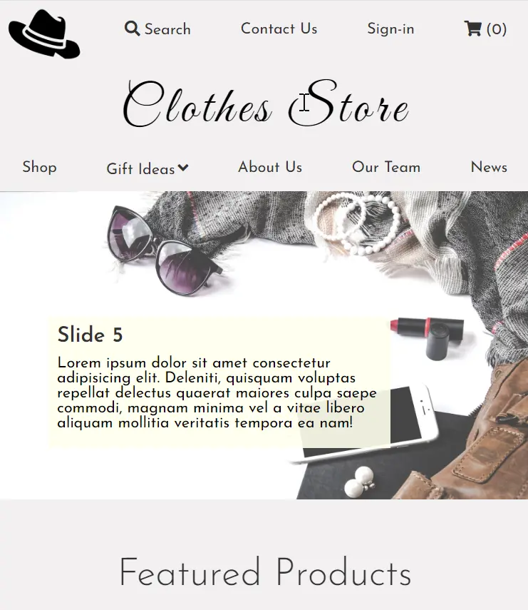

### 👋 **I am Erhan ERTEM**

&emsp;

## Udemy SASS The Complete SASS Course by Code And Create

### **Objective:** Clothes Store Web Page - Create a fictional responsive web page covering the principles of Advanced SASS

&emsp;

### Main Takeaways:

-  CSS Grid Layout
-  CSS Flex Layout
-  SASS map entry for variable declarations / Utilize SASS map-get() function
-  SASS list entry for an infinitely looping slide&timings series / Use @each loop directive, nth() function along with
   #{...} SASS template literal to select sub-multi entry list elements

&emsp;

#### [Clothes Store Project](https://clothesstore-erhan-ertem.netlify.app/)

---

